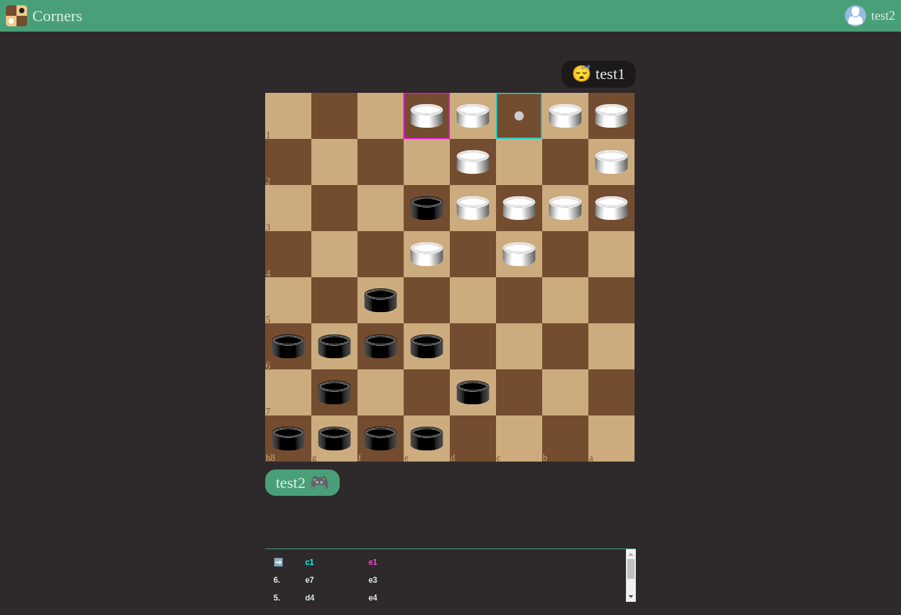

# Corners game

A simple game played on a chess board with checkers pieces and its own 
rules

## Required software

* Docker or Podman

## Dev environment

In the parent folder (`corners-game`):

`docker-compose -f docker-compose.override.yaml up` to start frontend and backend

## Build and run production images

`docker-compose -f docker-compose.prod.yaml up --build` 

### Alternatively:

The following commands need `yarn`:

`yarn workspace @corners-game/server start` start the server

`yarn workspace @corners-game/frontend start` start the GUI

## Additionaly

`yarn workspace @corners-game/bot start` start a battle of two dummy bots

## Cleanup

`yarn clean` removes all `dist` folders

`yarn clean_node` removes all `node_modules` folders
